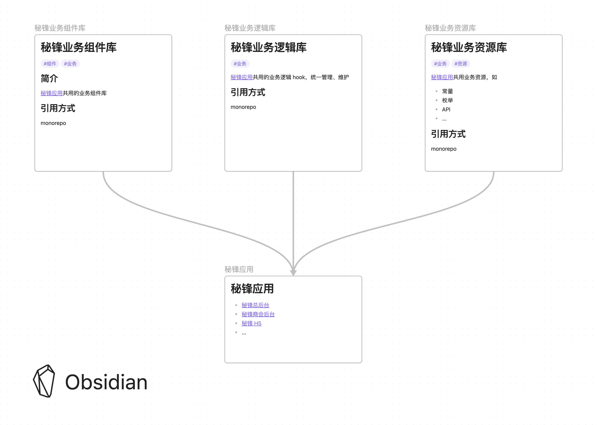

# 云商会管理后台

## 项目介绍

此项目是云商会后台管理系统前端项目，其中包含了[运营总后台（scrm）](./packages/shanghui-admin/)、[商会管理后台（秘锋）](./packages/mifeng-webapp/)、以及项目中的[公共资源（common）](./packages/business-common/)、[公共业务组件（components）](./packages/business-components/)、以及[公共业务逻辑（logics）](./packages/business-logics/)。

## 项目技术栈
项目使用了 monorepo 的方式管理，使用了 pnpm 作为包管理工具，使用了 pnpm-workspace 作为工作区管理工具。

- [x] [pnpm](https://pnpm.io/zh)
- [x] [pnpm-workspace](https://pnpm.js.org/en/workspaces)
- [x] [monorepo](https://en.wikipedia.org/wiki/Monorepo)

## 项目结构

```bash
├── README.md
├── package.json
├── packages
│   ├── business-common # 公用资源
│   ├── business-components # 公用业务组件
│   ├── business-logics # 公用业务逻辑
│   ├── mifeng-webapp # 商会管理后台（秘锋）
│   └── shanghui-admin # 运营总后台（scrm）
├── pnpm-lock.yaml
└── pnpm-workspace.yaml
```

### 项目架构




## 项目应用

- [运营总后台（scrm）](./packages/shanghui-admin/)
- [商会管理后台（秘锋）](./packages/mifeng-webapp/)

## 项目公用库 

- [公用资源（common）](./packages/business-common/)
- [组件（components）](./packages/business-components/)
- [业务逻辑（logics）](./packages/business-logics/)

## 项目启动

### 安装 pnpm
此项目使用了 pnpm 作为包管理工具，请先安装 pnpm。

```bash
npm install -g pnpm
```
### 安装依赖


```bash
pnpm install
```

### 启动项目

```bash
pnpm -F ${ProjectPackageName} run ${script}
```

示例：

```bash
pnpm -F mifeng run dev
```

### 项目打包

  ```bash
  pnpm -F ${ProjectPackageName} run ${script}
  ```

示例：

  ```bash
  pnpm -F mifeng run build
  ```

### pnpm 常用命令

`--filter, -F` 
筛选出需要执行的项目

```bash
pnpm -F ${ProjectPackageName} run ${script}
# or
pnpm -F ${ProjectPackageName} add ${package}

```


`--workspace`
将依赖安装在项目的根目录下，共用依赖

```bash
pnpm -w add ${package}
```